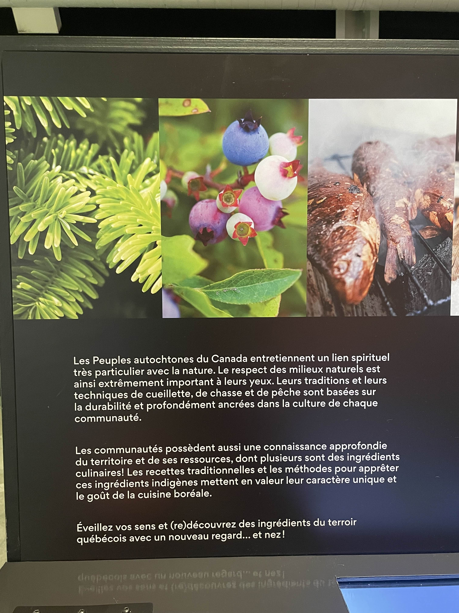

# Centre Des Sciences de Montréal 31/01/2025

  

## Exposition : Le Banquet

---
Le Banque est une exposition interactive sur la science de la nourriture, accessible à tous les âges.

Elle se déroule au Centre des sciences de Montréal dans le Vieux-Port et propose des activités ludiques pour mieux comprendre la cuisine.

Les visiteurs peuvent explorer différentes techniques de coupe, sentir des arômes variés et participer à un banquet fictif. Une façon amusante et éducative de découvrir la science derrière nos repas !

Réalisé en 2024 par *Cité des Sciences et de l'Industrie*

(Visité le 31 Janvier 2025)

---
## L'Oeuvre documentée : "Qui suis-je ?"

| image 1 | image 2 |
|----------|----------|
|  |  |
| image 3 | image 4 |
|  |  |

---

L'oeuvre  *Qui suis-je ?* est une expérience sensorielle interactive qui se concentre sur l'odorat et la réflexion. Le participant doit sentir une odeur particulière, puis lire une devinette pour l'aider à réfléchir. Il doit ensuite deviner l'aliment associé à cette odeur. 

## Type d'installation

**Type** : Dispositif interactif sensoriel.

## Mise en Espace

La station comprend les éléments suivants :
- Diffuseur d'odeurs
- Écran informatif
- Éléments visuels associés (ex : fumée, représentations d’aliments)

## Composantes et Techniques

Les composantes techniques incluent :
- **écran numérique** pour l'interaction
- **Câbles d'alimentation**

---

| Vue d'ensemble | Détails |
|----------|----------|
|  |  |

---

## Expérience personnelle

### Ce qui m'a plu : 
L’aspect interactif et immersif de l’expérience, la surprise de découvrir les réponses et l’ajout d’explications sur les aliments, ce qui rend l’expérience à la fois ludique et éducative. 
Apprendre d’où viennent les aliments et comment ils sont utilisés dans différentes cultures était fascinant.
### Ce que j’aurais fait autrement : 
Ajouter plus de variétés d’odeurs pour enrichir l'expérience et rendre les devinettes plus engageantes, ou même introduire un mode "difficulté" pour varier les défis.

---

# Références

| Référence 1 | Référence 2 |
|-------------|-------------|
|  |  |

