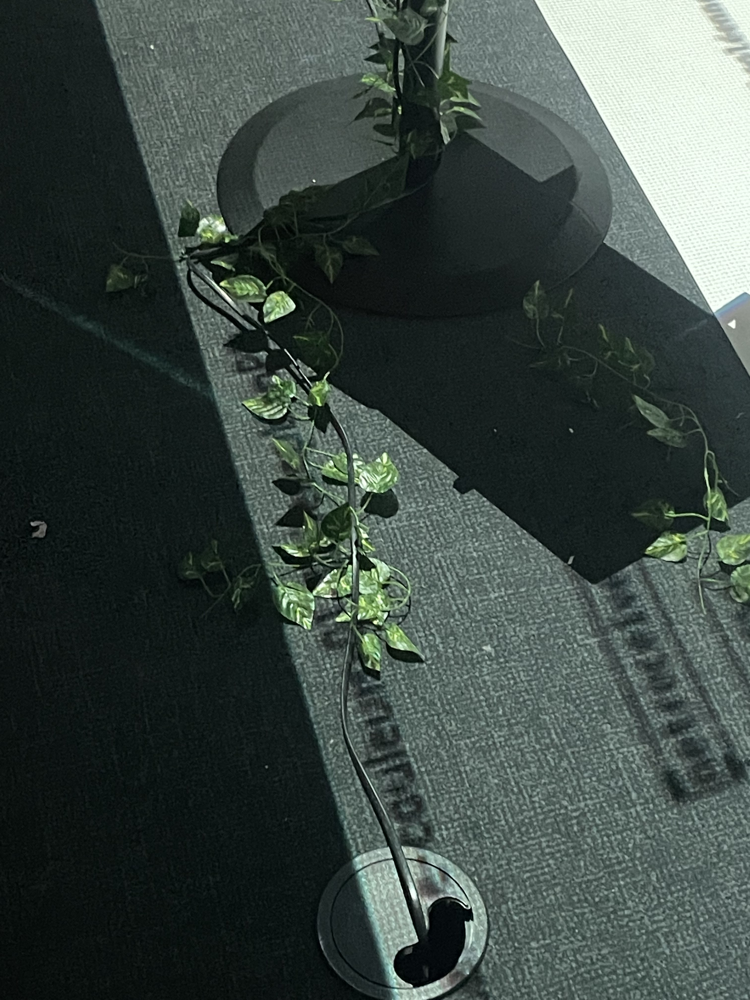
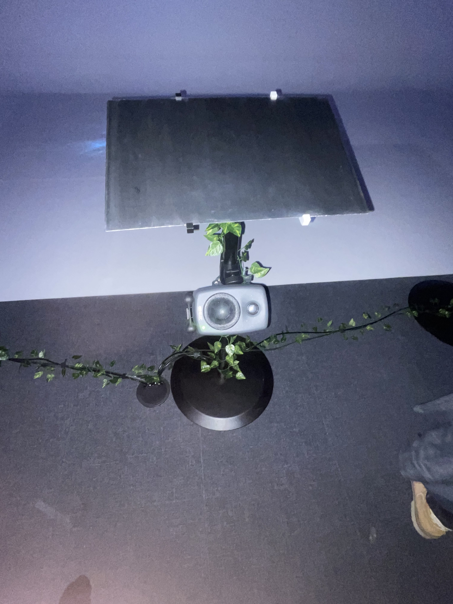

# LUMINATURA

---

## PRÉSENTATION GÉNÉRALE  

Luminatura est une installation immersive qui mélange habilement le visuel, l’audio et l’interactivité pour créer une expérience unique et captivante. J’ai eu l’opportunité, dans le cadre de ce cours, de la documenter et d’analyser son processus de création  . Ce projet ambitieux a été conçu par une équipe talentueuse de finissants, qui ont su allier créativité et expertise technique pour donner vie à une œuvre sensorielle engageante

  
   
  <i>Luminatura</i>

## L'ÉQUIPE DERRIÈRE CE PROJET

---

  
   

---
## LUMINATURA

| Image 1 | Image 2 |
|---------|-----------------|
|  |  |

| Image 3 |
|---------|
|  |

---

## EXPÉRIENCE PERSONNELLE  

### Première visite le 25 février 
Dès mon arrivée, j’ai été captivé par la richesse des couleurs et l’ambiance immersive de l’installation. L’un des aspects les plus intrigants était l’interactivité : en posant mes mains sur les plaques métalliques, je pouvais influencer l’expérience visuelle et sonore. Ce concept m’a immédiatement séduit.  

### Deuxième visite le 18 mars 
Pour la présentation finale, quelques améliorations ont été apportées. Une feuille explicative était ajoutée pour donner un aspect plus professionnel. Un projecteur supplémentaire dirigeait maintenant une partie de l’affichage vers le sol, créant une nouvelle dynamique visuelle.  

---

## MATÉRIAUX UTILISÉS  

Voici les principaux éléments techniques qui composent Luminatura :  

- 🔊  **3 plaques métalliques avec 3haut-parleurs**  
- 🏮 **plusieurs cables**  
- 💡 **3 projecteurs de lumière**
- 🏮 **5 ampoules**  
- 🎥 **2 projecteurs**  

| Cables | Plaque Métallique et Cables |
|----------|----------|
|  |  |
| Haut-parleur | Lanterneet Ampoules |
|  |  |

## RÉFLEXIONS PERSONNELLES  

### Ce qui m’a marqué  
J’ai adoré le fait que cette installation ne soit pas seulement un spectacle à observer, mais une œuvre qui prend véritablement vie grâce à l’interaction du spectateur. Poser les mains sur les plaques métalliques et entendre un son spécifique en réponse donnait l’impression d’être un élément essentiel du projet.  

### Ce que j’ai préféré  
L’expérience était particulièrement intéressante lorsque plusieurs personnes interagissaient simultanément avec les différentes plaques, créant ainsi une symphonie visuelle et sonore unique. Cela renforçait l’idée de connexion entre les visiteurs, ce qui ajoutait une belle dimension sociale à l’installation.  

---

## CE QUE J'AMÉLIORERAIS

- Même si l'expérience était immersive et bien pensée on pourrais modifier l’intensité et la nature des sons en fonction du temps ou du nombre de participants pour enrichir l'expérience auditive.
