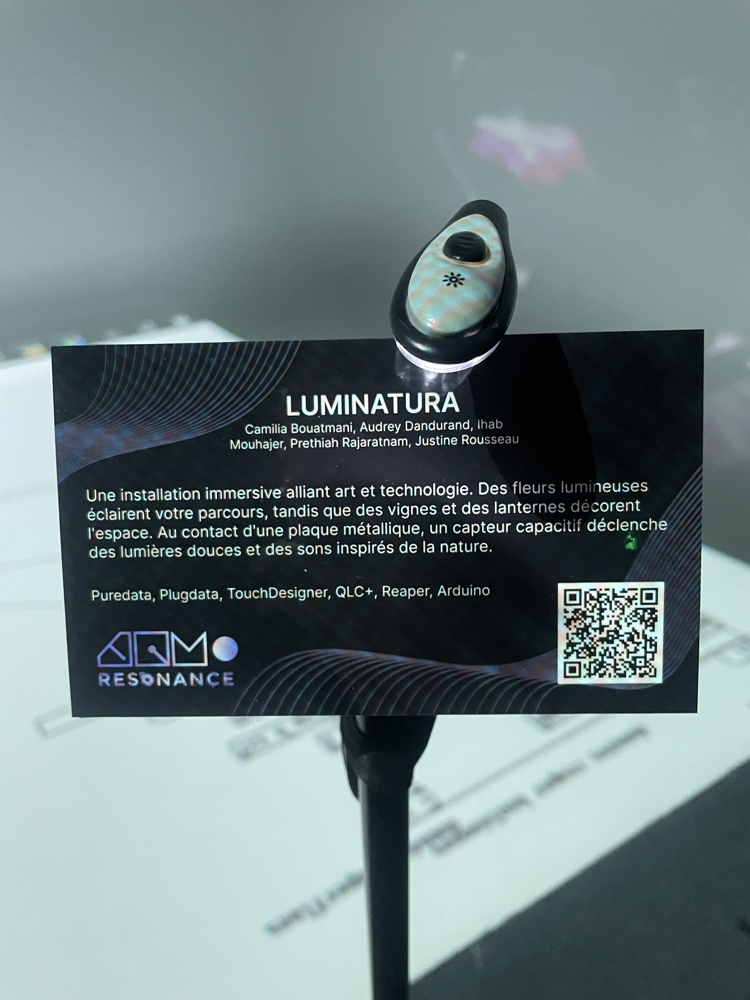
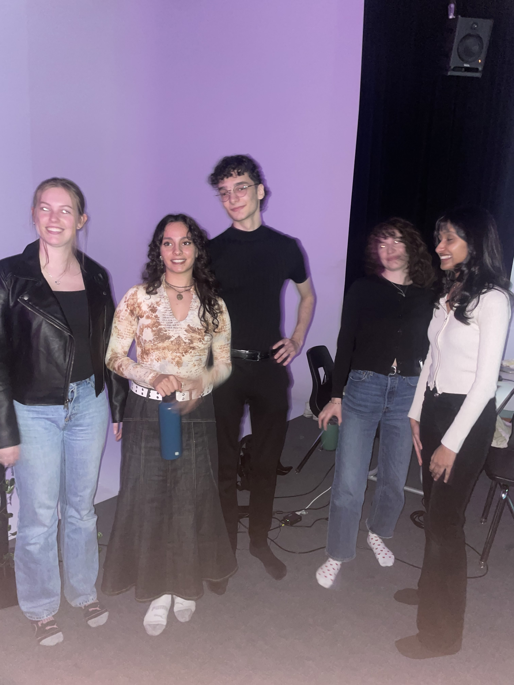
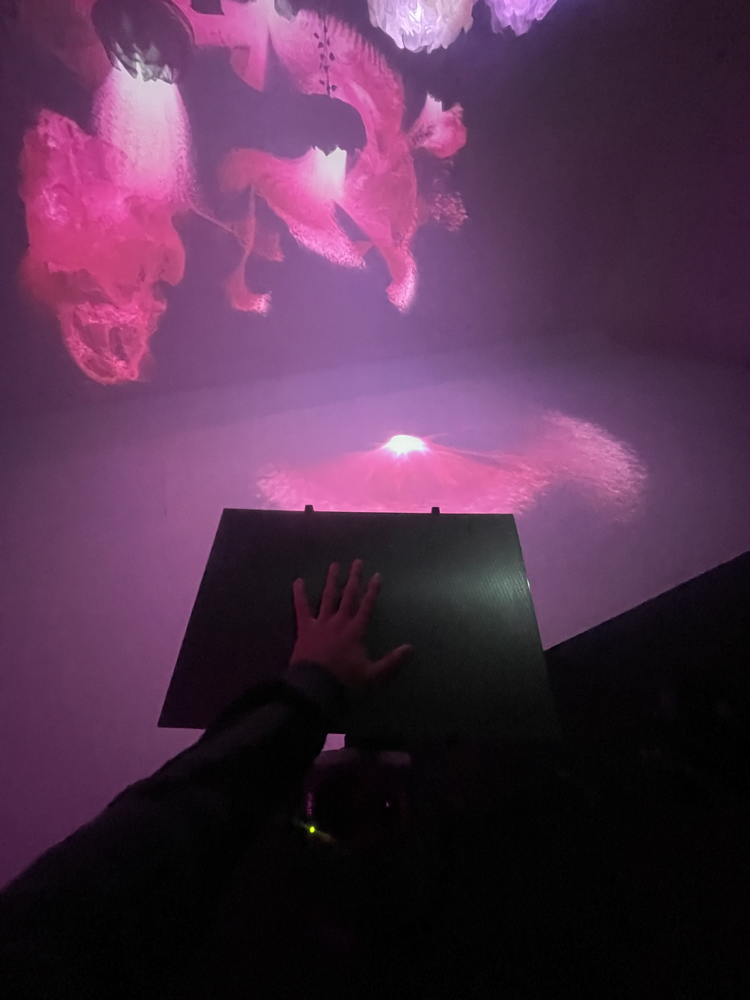
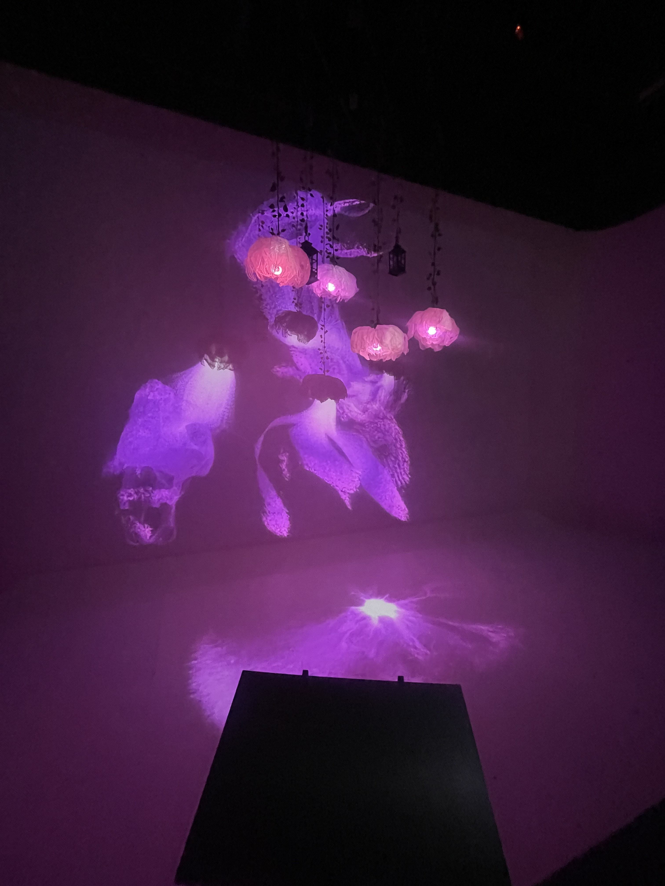
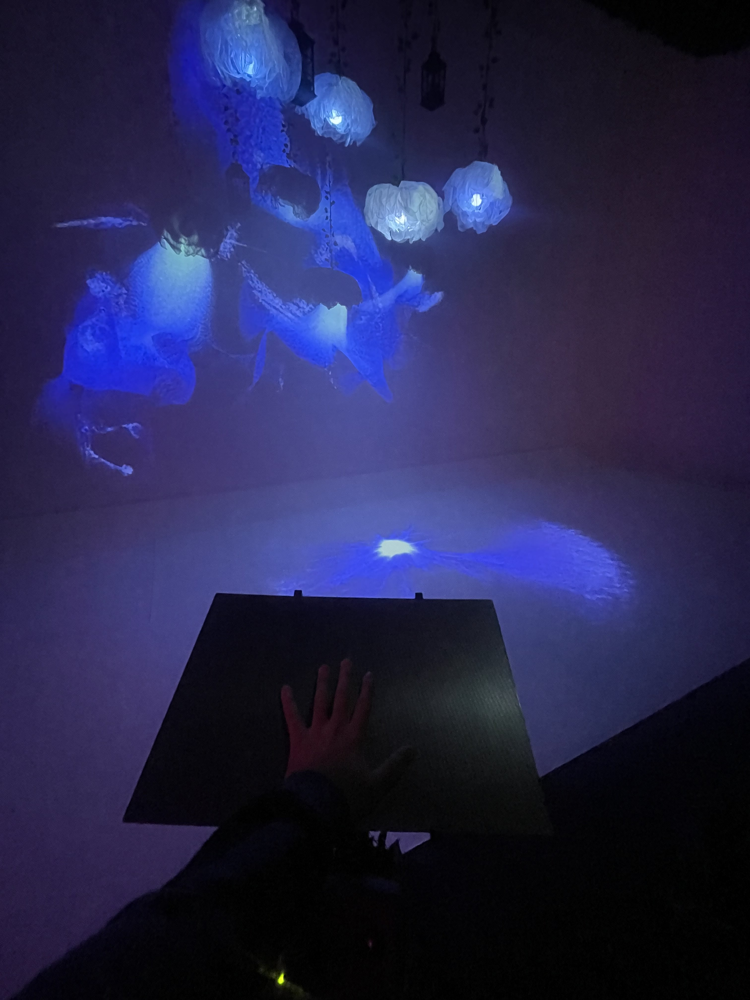
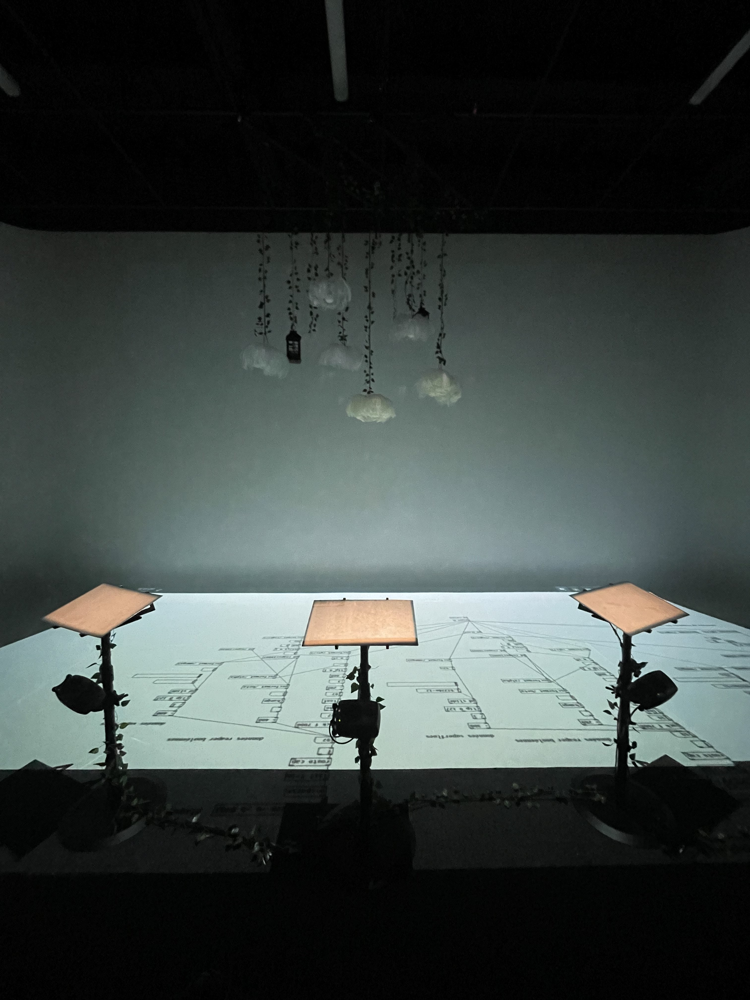

# LUMINATURA

---

## PRÉSENTATION GÉNÉRALE  

Luminatura est une installation immersive qui mélange habilement le visuel, l’audio et l’interactivité pour créer une expérience unique et captivante. J’ai eu l’opportunité, dans le cadre de ce cours, de la documenter et d’analyser son processus de création  . Ce projet ambitieux a été conçu par une équipe talentueuse de finissants, qui ont su allier créativité et expertise technique pour donner vie à une œuvre sensorielle engageante

  
   
  <i>Luminatura</i>

## L'ÉQUIPE DERRIÈRE CE PROJET

---

  
   

---
## LUMINATURA

| image 1 | image 2 |
|----------|----------|
|  |  |
| image 3 | image 4 |
|  |  |

---
---

## EXPÉRIENCE PERSONNELLE  

### Première visite le 25 février 
Dès mon arrivée, j’ai été captivé par la richesse des couleurs et l’ambiance immersive de l’installation. L’un des aspects les plus intrigants était l’interactivité : en posant mes mains sur les plaques métalliques, je pouvais influencer l’expérience visuelle et sonore. Ce concept m’a immédiatement séduit.  

### Deuxième visite le 18 mars 
Pour la présentation finale, quelques améliorations ont été apportées. Une feuille explicative était ajoutée pour donner un aspect plus professionnel. Un projecteur supplémentaire dirigeait maintenant une partie de l’affichage vers le sol, créant une nouvelle dynamique visuelle.  

---
