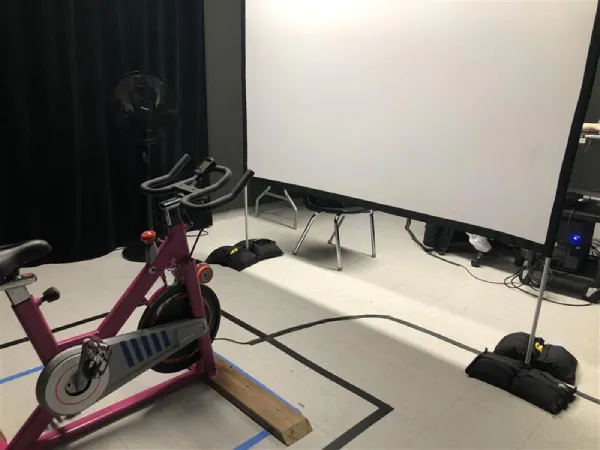

# EXPOSITION FINISSANT TIM 2025 - RESONANCE

## Info sur l'exposition

- **Lieu** : [Collège Montmorency]
- **Dates** : 17 au 21 mars 2025
- **Type** : Temporaire, en intérieur

## Arcadia

  
   

*Photo prise sur (https://cousi-cousa.github.io/Arcadia/#/)*

### Description :
Une installation qui nous plonge dans une ambiance rétro inspirée des anciennes arcades. Le jeu présenté a été conçu de A à Z par les étudiants, incluant le design sonore et les visuels. L'expérience rappelle les classiques du jeu vidéo tout en proposant une touche moderne.

### Ressenti :
J’ai beaucoup apprécié l’aspect nostalgique de l’installation. Le fait que tout ait été réalisé par les étudiants, du son au visuel, rend le projet très impressionnant. On sentait une vraie volonté de recréer l’atmosphère des salles d’arcade d’autrefois, et c’était réussi !

## Prismatica

  
   

*Photo prise sur (https://pootpookies.github.io/Prismatica/#/)*

### Description :
Cette installation propose une interaction artistique où les visiteurs peuvent tracer des formes et des couleurs sur un tableau. Grâce à une caméra qui scanne les dessins, ceux-ci prennent vie sous forme visuelle et sonore, rendant chaque expérience unique.

### Ressenti :
Le concept est vraiment original et invite à l’expérimentation. J’ai trouvé cependant que le rendu final manquait un peu d’impact, peut-être qu’un temps de traitement plus rapide aurait amélioré l’immersion. Néanmoins, l’idée d’associer le visuel au son était très intéressante.

---

## CON-DU8
 

  
   

*Photo prise sur (https://gearshift-games.github.io/Web-C0N-DU8/#/)*

### Description :
Une installation interactive où le visiteur doit pédaler sur un vélo stationnaire pour avancer dans un jeu. Une Kinect détecte les mouvements et permet au joueur d’interagir avec l’environnement virtuel.

### Ressenti :
Le concept est très engageant et immersif, mais j’ai trouvé que la maniabilité du vélo pouvait être améliorée. Néanmoins c'est une installation vraiment captivante.

---

## Fuga

  
   

*Photo prise sur (https://escapism-fuga.github.io/Fuga/#/)*

### Description :
Trois stations interactives permettent aux visiteurs de créer leur propre arbre numérique. Chaque action influence la forme et la croissance de l’arbre, qui est généré par un algorithme complexe.

### Ressenti :
L’idée de voir un arbre évoluer en fonction de nos interactions est fascinante. Par contre, j’ai trouvé que les différences entre les arbres créés étaient parfois trop subtiles. Peut-être qu’une variation plus marquée aurait rendu l’expérience encore plus marquante.

---
