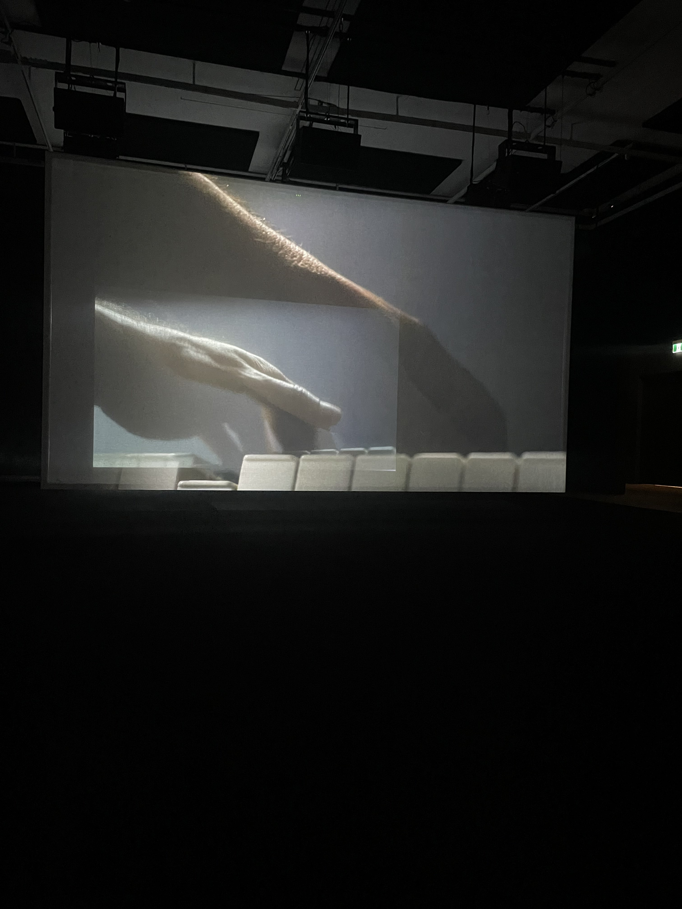

# MUSÉE DES BEAUX ARTS

Le 4 avril 2024, j’ai eu la chance de visiter le Musée des beaux-arts de Montréal. J’ai vu deux expositions : <i>Camp Wakonda</i> et <i>Ravel Ravel Interval</i>. C’est cette dernière que j’ai choisi de documenter. 

## Ravel Ravel Interval

  
   
 

## Description de l’œuvre

*Ravel Ravel Interval* est une installation vidéo immersive réalisée par l’artiste français d’origine albanaise Anri Sala. L’œuvre, présentée pour la première fois à la Biennale de Venise en 2013, est ici adaptée dans une version de 2017. 

L’installation montre **deux pianistes**, Louis Lortie (Montréal) et Jean-Efflam Bavouzet (France). Les deux pianistes jouent **presque en même temps**, mais avec des légères différences de rythme. Par moments, ils sont parfaitement synchronisés, puis ils se décalent, se retrouvent, se perdent à nouveau… .Ce qui est marquant, c’est que les images semblent légèrement transparentes, cela donne l’impression qu’on peut voir à travers les couches d’images et que les deux interprétations se **superposent visuellement**.

  
   
 

---

## ✨ Mon ressenti

Franchement, cette œuvre m’a un peu plus intéressé que ce à quoi je m’attendais. Même si ce n’est pas exactement mon style préféré, j’ai trouvé le concept original et assez **fascinant**. Voir deux versions d’un même morceau qui se répondent, parfois en harmonie et parfois non, c’était **étrange mais captivant**.
Ce n’est pas une œuvre que je retournerais voir plusieurs fois, mais elle m’a fait réfléchir, et je reconnais qu’elle est **intelligente et bien réalisée**.

---
