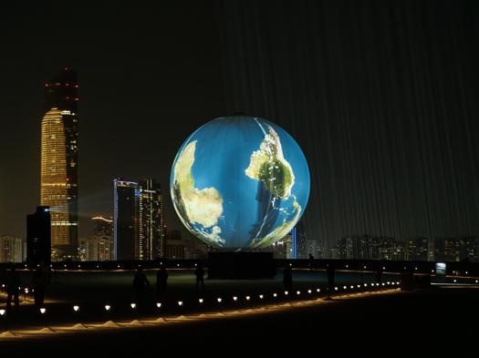

# Conférence sur Rafael Lozano-Hemmer #

---

## Introduction ##

Le Mardi 25 mars 2025,  j’ai assisté à une conférence portant sur l’artiste Rafael Lozano-Hemmer. Durant cette présentation, Jade Séguéla a exposé deux œuvres marquantes de l’artiste : **Shadow Tuner** et **Sphere Packing: Bach**. Elle a pris le temps d’expliquer les aspects techniques et logistiques de ces installations interactives, tout en mettant en lumière l’intention artistique derrière chaque pièce.

| Shadow Tuner | Sphere Packing: Bach |
|---------|-----------------|
|  |  |

### Œuvre 1 – Shadow Tuner ###

Cette œuvre utilise une sphère gonflable de grande dimension sur laquelle est projetée une image animée de la Terre. Le visiteur, capté par une caméra, voit son ombre projetée sur la surface terrestre. Lorsqu'une ombre passe sur une ville, une station de radio locale de cette ville se met automatiquement à jouer, créant un paysage sonore mondial et évolutif.

### Œuvre 2 – Sphere Packing: Bach ###

Cette installation sonore monumentale est composée de **1 128 haut-parleurs** intégrés dans une sphère de 3 mètres de diamètre. Chaque haut-parleur diffuse une composition différente de Johann Sebastian Bach. L’ensemble crée un environnement sonore dense et complexe, dans lequel on peut entrer pour vivre une immersion musicale totale.

## Conclusion ##

Cette conférence m’a vraiment permis de découvrir la profondeur du travail de Lozano-Hemmer. J’ai été impressionné par la fusion entre technologie et art, et par la complexité que cela demande en coulisses, autant du point de vue logistique que technique.
